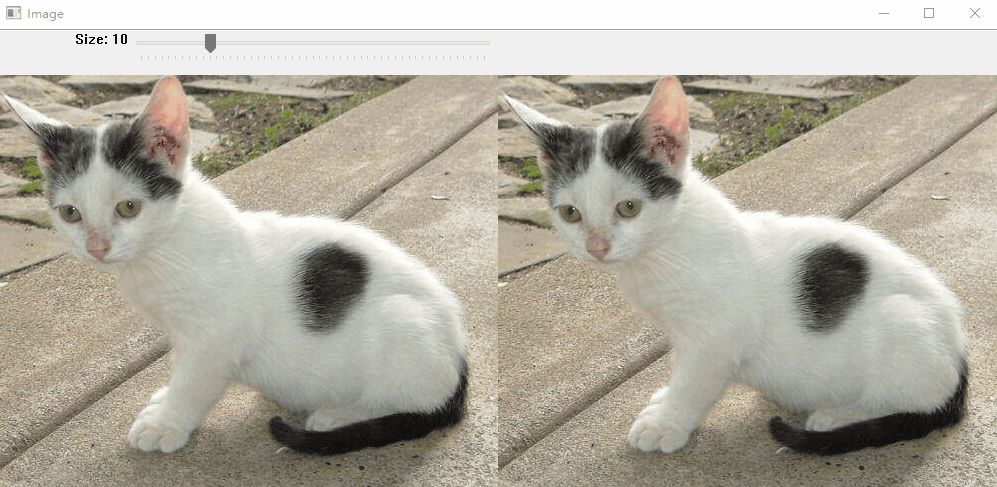
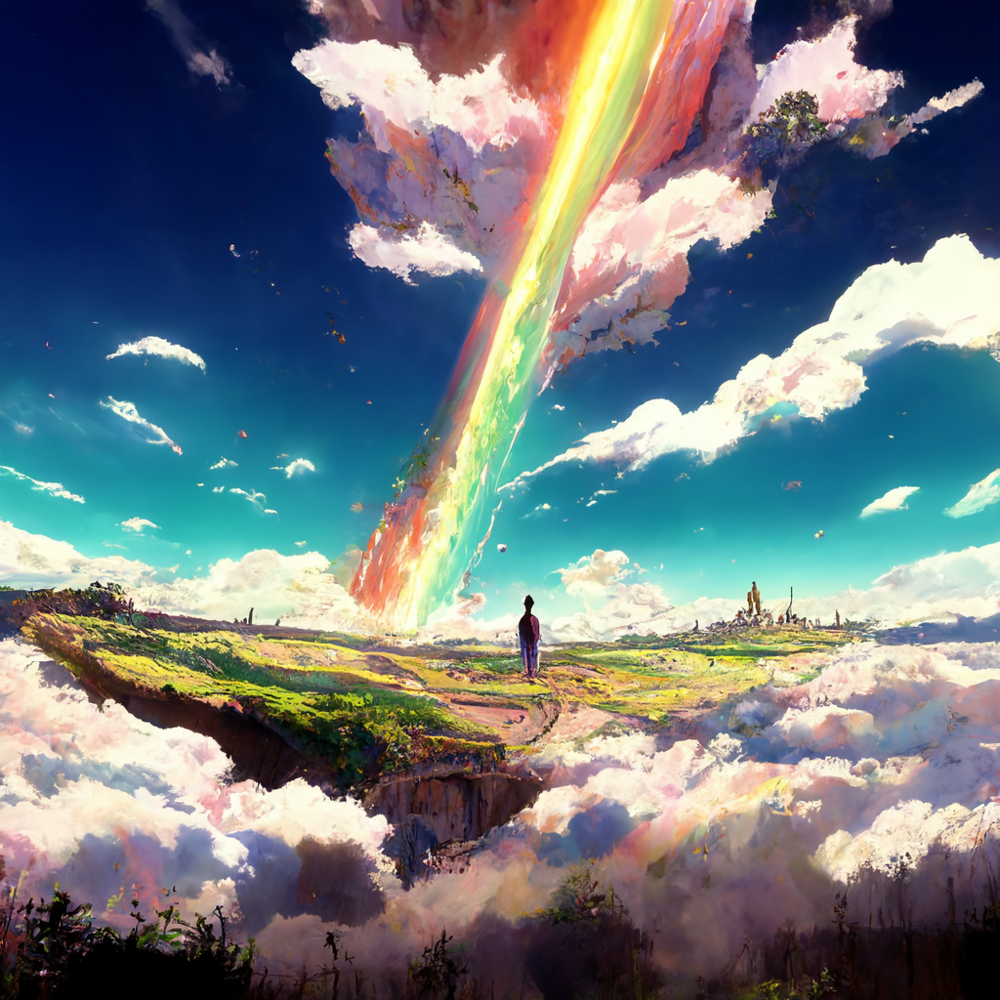
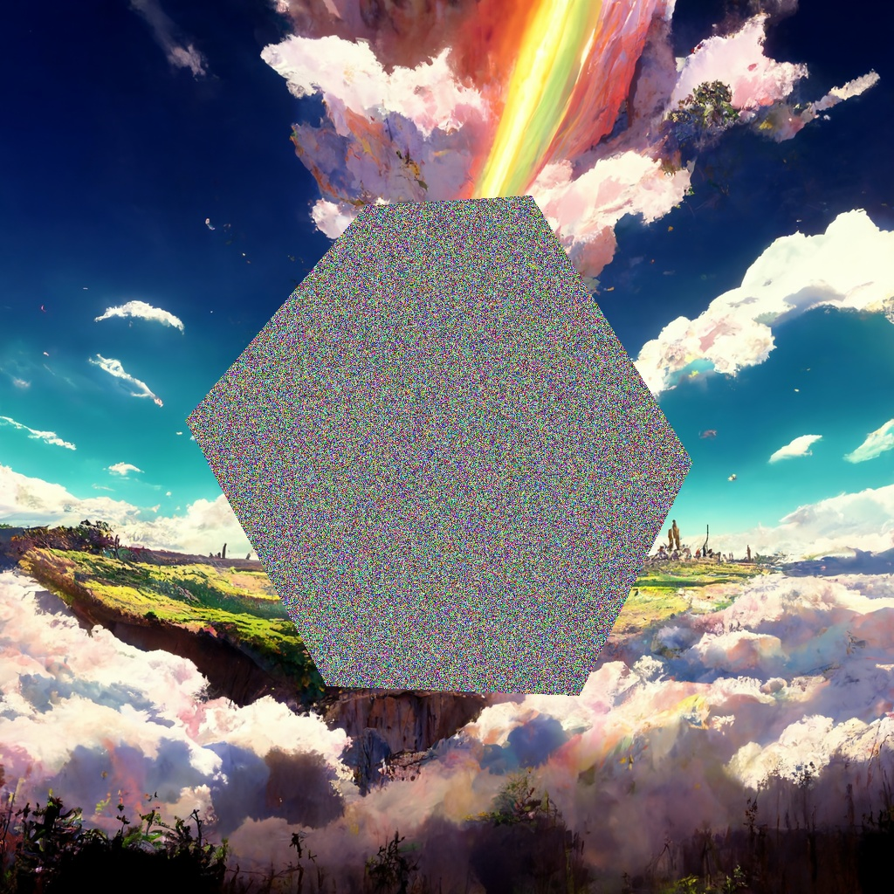
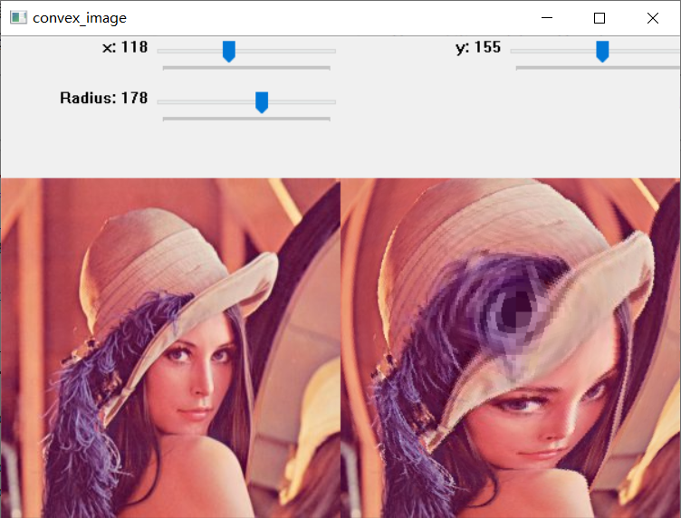
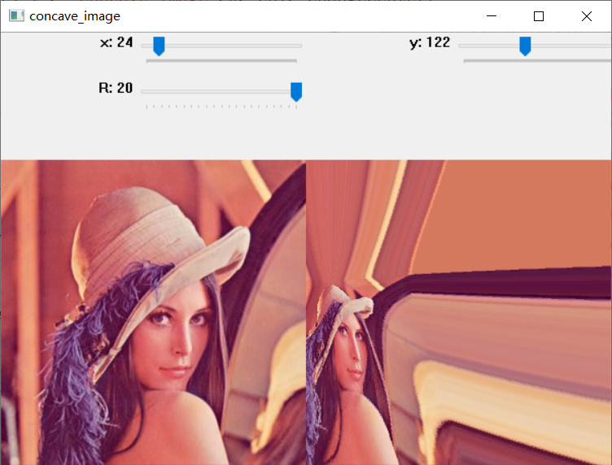
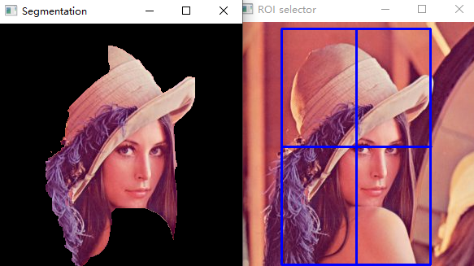
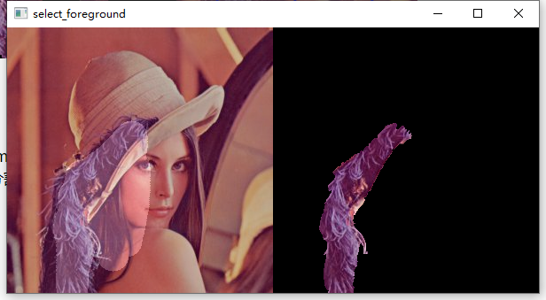

# OpenCV + Python：图像与视频处理基础（8讲）

## 第1讲：[OpenCV基础](https://github.com/hongsong-wang/OpenCV-Python-Image-Processing/blob/main/1_OpenCV%E5%9F%BA%E7%A1%80.pdf)

  

## 第2讲：[图像基础](https://github.com/hongsong-wang/OpenCV-Python-Image-Processing/blob/main/2_%E5%9B%BE%E5%83%8F%E5%9F%BA%E7%A1%80.pdf)

  
  

## 第3讲：[颜色空间](https://github.com/hongsong-wang/OpenCV-Python-Image-Processing/blob/main/3_%E9%A2%9C%E8%89%B2%E7%A9%BA%E9%97%B4.pdf)

## 第4讲：[图像变换](https://github.com/hongsong-wang/OpenCV-Python-Image-Processing/blob/main/4_%E5%9B%BE%E5%83%8F%E5%8F%98%E6%8D%A2.pdf)

  
  

## 第5讲：[图像分割](https://github.com/hongsong-wang/OpenCV-Python-Image-Processing/blob/main/5_%E5%9B%BE%E5%83%8F%E5%88%86%E5%89%B2.pdf)

  
  

## 第6讲：[其它图像处理](https://github.com/hongsong-wang/OpenCV-Python-Image-Processing/blob/main/6_%E5%85%B6%E5%AE%83%E5%9B%BE%E5%83%8F%E5%A4%84%E7%90%86.pdf)

## 第7讲：[动画与视频](https://github.com/hongsong-wang/OpenCV-Python-Image-Processing/blob/main/7_%E5%8A%A8%E7%94%BB%E4%B8%8E%E8%A7%86%E9%A2%91.pdf)

## 第8讲：[目标跟踪](https://github.com/hongsong-wang/OpenCV-Python-Image-Processing/blob/main/8_%E7%9B%AE%E6%A0%87%E8%B7%9F%E8%B8%AA.pdf)

# Acknowledgements
本课程已由本人在某985高校为大二暑期本科生连续讲授三年，获得了广泛好评，在此分享给各位网友。制作时主要参考如下资料，如有兴趣请购买正版，尊重原作者版权。

[1] [OpenCV轻松入门：面向Python](https://book.douban.com/subject/33477080/)

[2] [OpenCV-Python-Toturial-中文版](https://www.cnblogs.com/Undo-self-blog/p/8423851.html)

若该文档对您有所帮助，请在页面右上角点个Star⭐支持一下，谢谢！

如果转载该文档的内容，请注明出处：https://github.com/hongsong-wang/OpenCV-Python-Image-Processing

